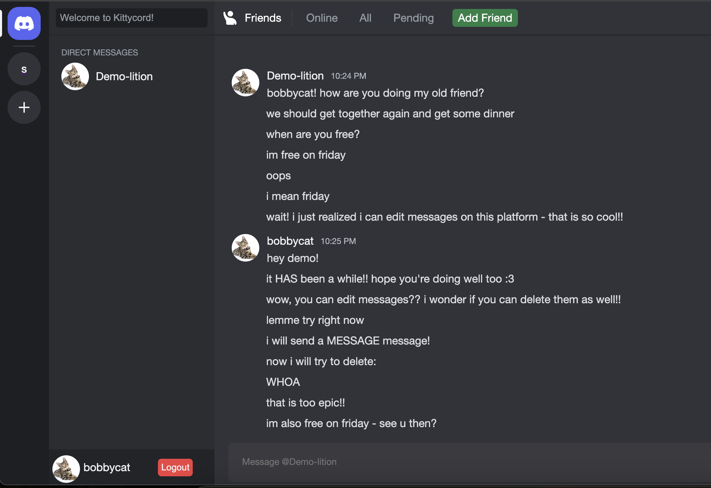
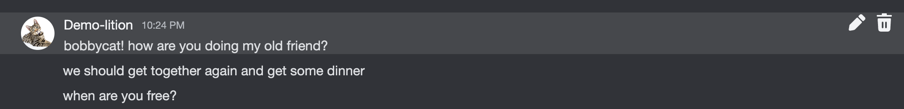
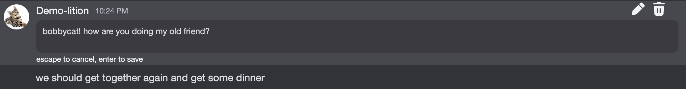
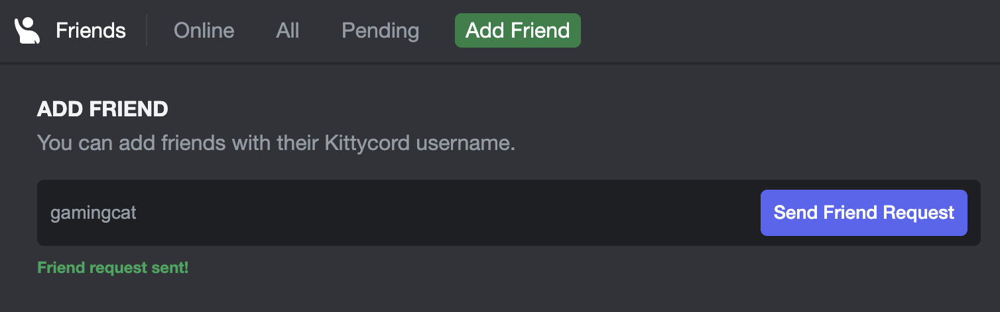
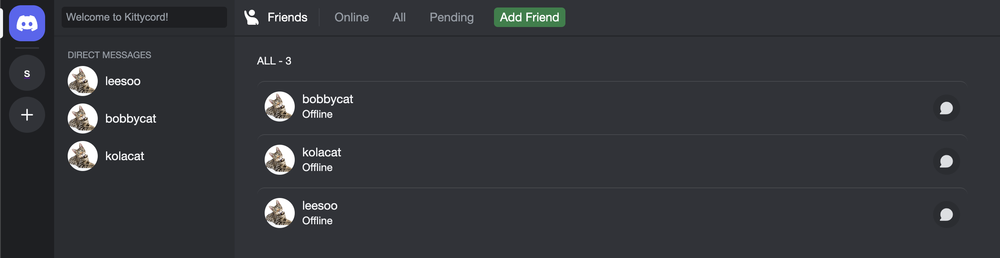
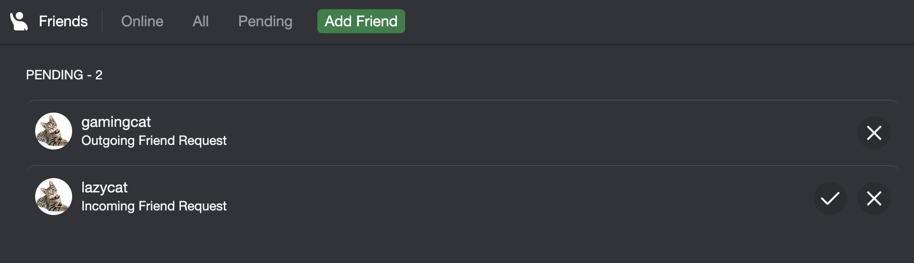

# Kittycord

[Live Link](https://kittycord.onrender.com)

## Description
Kittycord is a clone of Discord, a text/voice chat app made for cat lovers to connect with their friends! Because it is a clone, I aimed to replicate Discord's theme. I personally love the modern design and layout of Discord and am a regular user, which is why I chose it for my project.

## Features!
1. User Authentication

Users can sign up, login, and logout. Depending on whether or not the user is logged in, will also display a different page. Users will also be shown stylized dynamic error handling.

2. Live Messaging

Users can send messages live to other users that they are friends with or already have a history of direct messages with. The relevant edit/delete buttons only show up when the message is hovered:

3. Updating and deleting messages

Users can read, send, edit, and delete their messages live. When the user edits a message, it opens up a modal for that message that goes away when you either update the message or press escape. This way, the original message is preserved while an input textbox prompt pops up for the user to write a temporary message that may or may not be saved.

4. Add Friends

Users can add friends

Sort their friends by all, online, or pending

And view their pending outgoing and incoming friend requests

5. Create and Access Servers (in progress)

Currently, users are able to access servers. I am working on the feature to allow users to create servers!

## Technologies, Libraries, APIs
- npm 
- React
- Rails
- fontawesome

