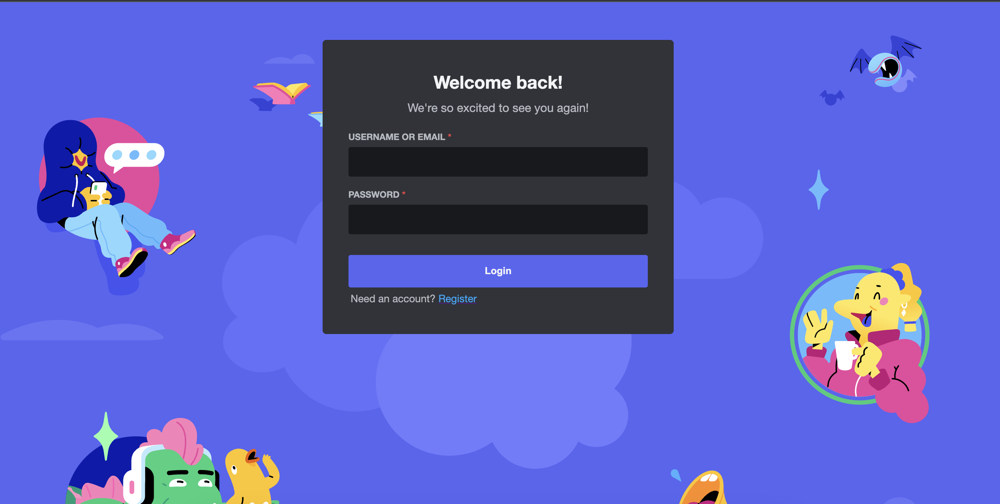
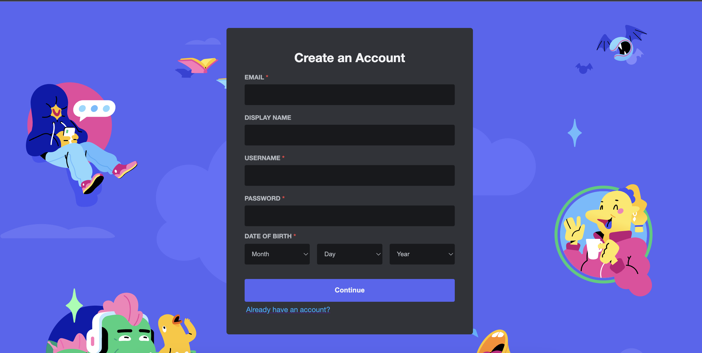
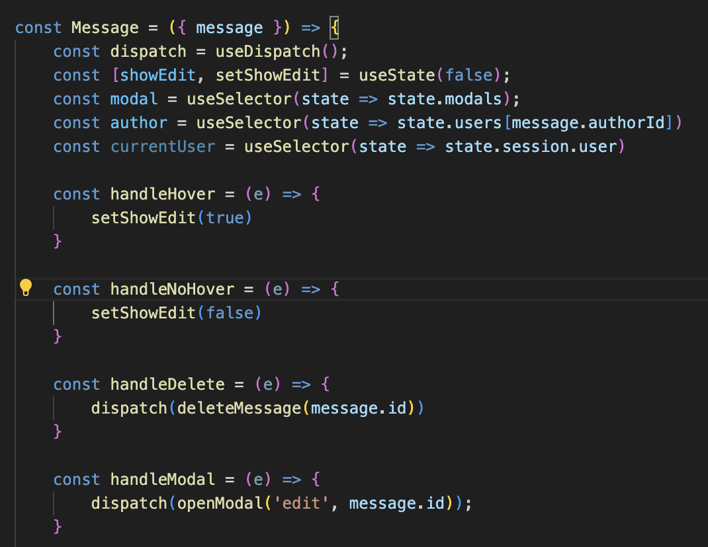
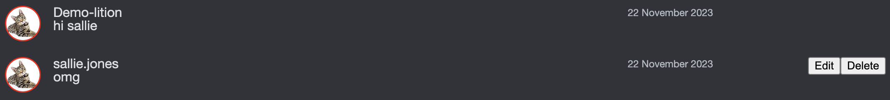
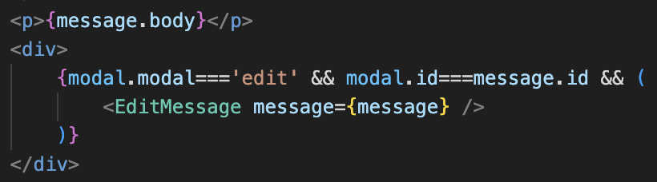
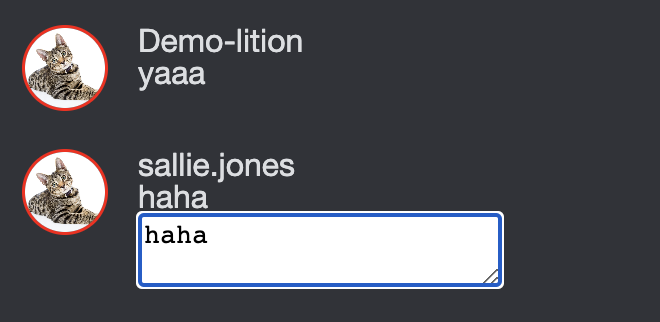
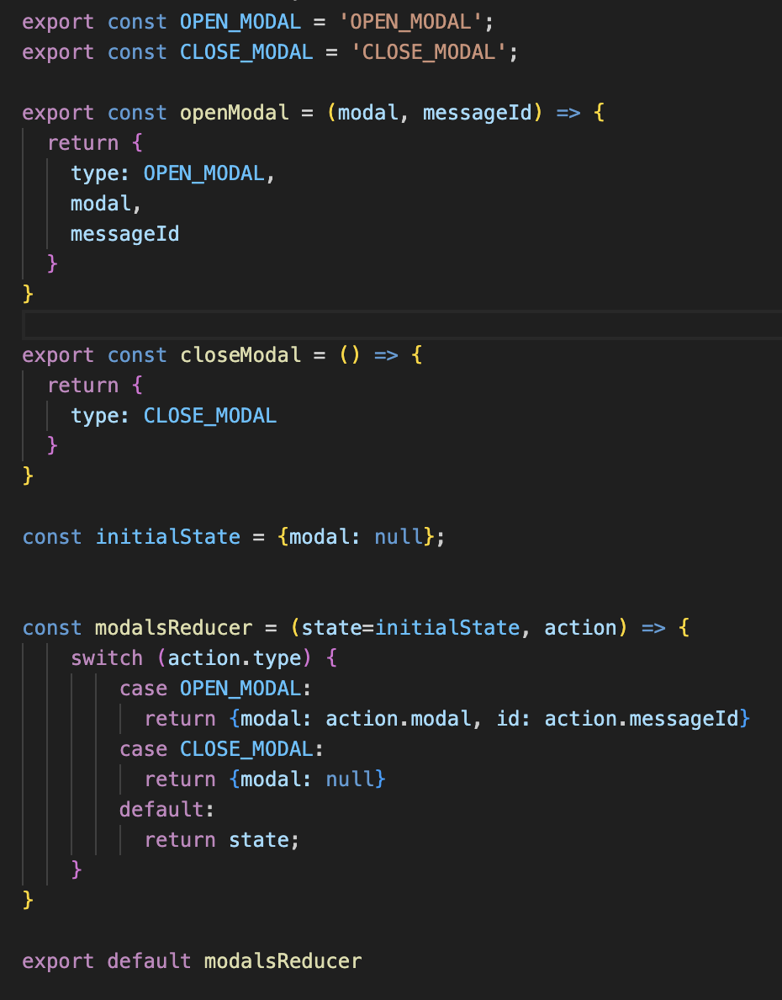

# Kittycord

[Live Link](https://kittycord.onrender.com)

## Description
Kittycord is a clone of Discord, a text/voice chat app made for people (especially cat lovers) of all ages to connect to their friends and more online communities. Because it is a clone, I aimed to replicate Discord's appearance as much as I feasibly could. I personally love Discord's layout and UX, which is why I chose it for my project.

## Features (to be updated)
1. User Authentication

Users can sign up, login, and logout. Depending on whether or not the user is logged in, will also display a different page. I also implemented error handling.

2. Live Messaging

Users can send messages live to other users that they are friends with or have direct messages with. 

In my message component, I also implemented hover events and modals, so that the edit/delete buttons only show up when the message is hovered:

3. Updating and deleting messages

Users can read, send, edit, and delete their messages live. When the user edits a message, it opens up a modal for that message that goes away when you either update the message or press escape:

## Technologies, Libraries, APIs
- npm 
- React
- Rails

